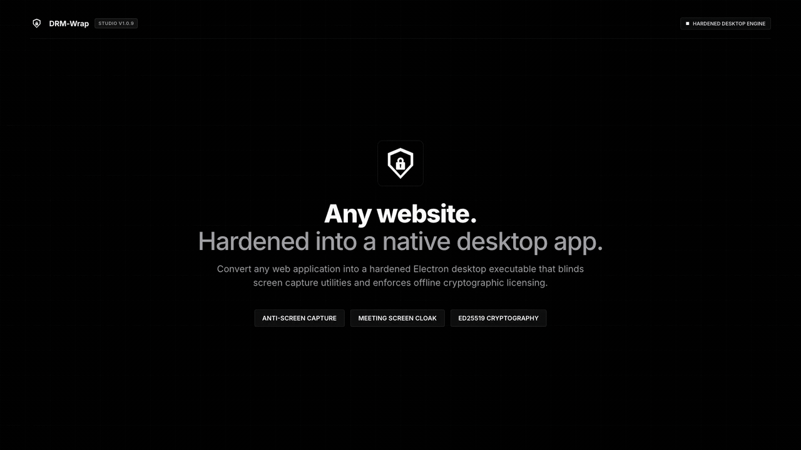

# 🛡️ DRM-Wrap — Production-Ready Secure Electron Desktop App Wrapper

> Convert any existing website (Laravel, React, Next.js, Vue, Nuxt, CodeIgniter, WordPress, or plain HTML) into a hardened, production-ready Electron desktop app with anti-screen-capture, meeting screen-share cloaking, dynamic forensic watermarks, and offline cryptographic Ed25519 licensing.

[](https://github.com/vecvel)
[](https://github.com/vecvel/drm-wrap/releases/latest)
[](LICENSE)
[](https://vecvel.github.io/drm-wrap/)
[](https://www.electronjs.org/)
[](https://www.typescriptlang.org/)
[](https://nodejs.org/)
[](https://github.com/vecvel/drm-wrap)

---

<p align="center">
  
</p>

---

## 🌟 Overview

**DRM-Wrap** is an enterprise-grade CLI and GUI engine that packages web applications into native Windows (`.exe`) and macOS (`.dmg`) desktop installers while enforcing client-side digital rights management (DRM).

Built with **Electron**, **TypeScript**, and asymmetric **Ed25519 digital signatures**, it empowers software vendors, content creators, training platforms, and SaaS providers to distribute desktop wrappers of their web applications without writing boilerplate desktop code or altering a single line of their existing backend codebase.

---

## ✨ Key Security & Protection Features

### 🚫 1. Anti-Screen Capture & Recording Prevention
- **Hardware-Accelerated Content Protection**: Automatically enables native OS content protection flags (`setContentProtection(true)`):
  - **Windows**: Maps to `SetWindowDisplayAffinity` (`WDA_MONITOR`), causing screenshots and recording tools to capture a pure black box.
  - **macOS**: Configures `NSWindowSharingNone`, blinding screenshot utilities and window recording APIs.
- **Keyboard Shortcut Interception**: Blocks print-screen keys, system screenshot combinations (`Cmd+Shift+3`, `Cmd+Shift+4`, `Cmd+Shift+5`, `Win+Shift+S`, `Alt+PrtScn`), and developer shortcuts.

### 👻 2. "Invisible Mode" Meeting Screen-Share Cloaking
- Prevents protected windows from appearing when users share their desktop or individual application windows in popular video conferencing applications:
  - **Zoom**
  - **Google Meet**
  - **Microsoft Teams**
  - **Discord** / **Slack** / **Webex**
- Utilizes workspace window level positioning and OS display exclusion routines.

### 💧 3. Dynamic Forensic Watermarking
- **Anti-Tamper Canvas Overlay**: Renders an uninterruptible, non-interactive 2D canvas layer overlaying web content.
- **Dynamic Variable Interpolation**: Embeds client identity, license ID, timestamp, and optional host hash dynamically.
- **Customizable Typography & Density**: Control opacity, font size, angle, repeating spacing, and color directly from configuration.

### 🔍 4. Active Screen Recording Process Detection
- **Process Scanner Engine**: Background heartbeat process actively scans running system tasks against an up-to-date database of known capture utilities:
  - Open Broadcaster Software (`obs`, `obs64`)
  - Camtasia (`camtasia`, `camrecorder`)
  - ShareX (`sharex`)
  - QuickTime Player (`quicktimeplayer`)
  - Windows Game Bar (`gamebar`, `bcastdvr`)
  - Bandicam, Loom, ScreenFlow, and generic screen recorders.
- **Automated Threat Escalation**: Configurable response actions upon detection:
  - `blur`: Immediately applies a 40px CSS blur filter over the entire viewport.
  - `block`: Displays a blocking warning screen with instructions to quit the recording software.
  - `terminate`: Quits the application immediately to safeguard proprietary media.

### 🔒 5. DevTools Lockout & Hardened Sandbox
- Context isolation (`contextIsolation: true`) strictly enforced.
- Node.js integration disabled in renderer processes.
- DevTools completely disabled in production builds.
- Context menu right-click inspection disabled.

### 🔐 6. Offline Cryptographic Asymmetric Licensing
- **Ed25519 Curve25519 Digital Signatures**: Uses the highest-security modern asymmetric curve for ultra-fast, tamper-proof license tokens.
- **100% Offline Verification**: Public key embedded in client builds; private signing key remains strictly in vendor hands.
- **Domain Locking**: Optionally restrict a license token to a specific web domain and its subdomains (e.g. `*.myplatform.com`).
- **Flexible Expiration**: Support for Lifetime / Perpetual licenses, fixed-day subscriptions, trial periods, and short-lived evaluation tokens.

---

## 🏛️ Monorepo Architecture

```
drm-wrap/
├── .github/
│   └── workflows/
│       ├── build.yml                 # Monorepo CI: Typechecks and native OS packaging
│       ├── generate-license.yml      # GitHub Actions Dispatch: Issue customer licenses on cloud
│       └── pages.yml                 # Automated deployment of Web License Generator to GitHub Pages
├── packages/
│   ├── lib/                          # [Published] 'drm-wrap' CLI & core detection/licensing engine
│   │   ├── src/cli/                  # Interactive CLI (init, config, dev, build, license)
│   │   └── src/core/                 # Core engine (scaffold, license, detection, process monitors)
│   ├── desktop-app/                  # Electron runtime template (main process, DRM preload bridge)
│   ├── studio/                       # 'DRMWrap' — Standalone desktop GUI wizard for non-technical users
│   └── license-admin/                # [Vendor-Only, Never Published] Ed25519 key generation & license issuer
├── tools/
│   └── license-generator.html        # Standalone Web GUI License Authority (WebCrypto Ed25519)
├── index.html                        # GitHub Pages root entrypoint (auto-redirect to tools generator)
├── LICENSE                           # Proprietary Commercial Software License @vecvel
└── CODE_OF_CONDUCT.md                # Contributor Code of Conduct
```

| Package / Module | Role | Publishing Target |
|---|---|---|
| **[`packages/lib`](./packages/lib)** | Core detection engine, CLI commands, and scaffold generator. | Published (`@vecvel/drm-wrap` on GitHub Packages) |
| **[`packages/desktop-app`](./packages/desktop-app)** | Production Electron shell injected with DRM listeners and preload bridges. | Bundled into scaffolded builds |
| **[`packages/studio`](./packages/studio)** | **DRMWrap**: Complete GUI desktop application for building apps without terminal commands. | Desktop Installer (`.dmg`, `.exe`) |
| **[`packages/license-admin`](./packages/license-admin)** | Keypair creation and command-line license issuing scripts. | Internal (Never Published) |
| **[`tools/license-generator.html`](./tools/license-generator.html)** | Browser-based WebCrypto Ed25519 license generator. | GitHub Pages / Offline Web |

---

## 🛠️ Technology Stack

| Component | Technology | Description |
|---|---|---|
| **Desktop Runtime** | [Electron 31+](https://www.electronjs.org/) | Cross-platform Chromium and Node.js desktop framework. |
| **Language & Typings** | [TypeScript 5.5](https://www.typescriptlang.org/) | Strict type checking and ESM/CJS build pipelines. |
| **CLI Framework** | [Commander](https://github.com/tj/commander.js) + [@clack/prompts](https://github.com/natemoo-re/clack) | Interactive CLI prompts with spinners and styled outputs. |
| **Packaging & Distribution**| [electron-builder](https://www.electron.build/) | Code signing, DMG packaging, NSIS Windows installers. |
| **Cryptography** | [Ed25519 Curve25519](https://ed25519.cr.yp.to/) | Ultra-secure 256-bit asymmetric digital signatures via `node:crypto` and `WebCrypto`. |
| **Process Inspection** | [ps-list](https://github.com/sindresorhus/ps-list) | Lightweight cross-platform native process table auditing. |
| **Configuration Engine** | [Zod 3.23](https://zod.dev/) | Strict runtime schema parsing and validation. |

---

## 🚀 Getting Started

### Prerequisites
- **Node.js**: `v20.0.0` or higher
- **npm**: `v9.0.0` or higher

### Developer Monorepo Setup

```bash
# 1. Clone repository
git clone https://github.com/vecvel/drm-wrap.git
cd drm-wrap

# 2. Install workspace dependencies
npm install

# 3. Build core engine & copy templates
npm run build

# 4. Launch Desktop Demo App
npm run dev

# 5. Launch DRMWrap Studio GUI
npm run dev:studio
```

---

## 💻 End-User CLI Workflow

Once published or linked, users can wrap any website in 5 simple commands:

```bash
# 1. Initialize a new wrapped desktop project
npx @vecvel/drm-wrap init

# 2. Customize protections (Anti-screenshot, Watermark, Recorder detection)
npx @vecvel/drm-wrap config

# 3. Test and preview in live Electron development mode
npx @vecvel/drm-wrap dev

# 4. Activate your commercial license key
npx @vecvel/drm-wrap license activate <YOUR_TOKEN_STRING>

# 5. Build production installers (.exe for Windows, .dmg for macOS)
npx @vecvel/drm-wrap build
```

---

## 🔐 Cryptographic Offline Licensing Guide

DRM-Wrap features an unforgeable, offline-verifiable licensing model based on **Ed25519** digital signatures. No license server is needed: the client binary embeds the public key, and you issue licenses with your private key.

### Token Wire Format

```
${base64url(JSON_payload)}.${base64url(Ed25519_signature)}
```

The signature covers the exact ASCII bytes of the `base64url(JSON_payload)` string, preventing JSON whitespace or key-order ambiguities.

---

### 🌐 Option A: Web GUI Generator (Standalone & GitHub Pages)

Access the live browser-based generator:
👉 **[Open Live License Generator on GitHub Pages](https://vecvel.github.io/drm-wrap/)**

Or open [`tools/license-generator.html`](./tools/license-generator.html) locally in any browser:
- Built with modern **W3C WebCrypto API** (`SubtleCrypto` Ed25519).
- Secure local key caching: saves your private key in browser `localStorage` (never transmits over the network).
- Configurable customer name, contact email, tier (`single` or `extended`), domain locks, and validity duration.
- One-click `.lic` file download and activation token copying.
- Built-in **Token Inspector**: paste any token to inspect its claims and verify its Ed25519 signature in real time.

---

### ☁️ Option B: GitHub Actions Cloud Generator

Generate signed customer licenses directly on GitHub without installing local tools:

1. Navigate to **Actions → Generate Customer License** in your GitHub repository.
2. Click **Run workflow** and provide:
   - **Customer Name**: e.g., `Acme Corporation`
   - **Customer Email**: e.g., `licenses@acme.com`
   - **Tier**: `single` or `extended`
   - **Domain**: Optional domain restriction (e.g., `acme.com`)
   - **Validity Type**: `subscription`, `lifetime`, or `trial`
   - **Private Key**: Paste your private key, or configure the repository secret `LICENSE_PRIVATE_KEY`
3. The workflow signs the license, outputs the key in the **Job Summary**, and attaches the `.lic` file as a 30-day artifact.

---

### ⌨️ Option C: Terminal CLI Script

Issue licenses locally using the monorepo script:

```bash
# 1. 1-Year Subscription License
npm run license:issue -- --customer "Apex Studios" --email "dev@apex.com" --tier single --days 365

# 2. Lifetime License with Domain Lock
npm run license:issue -- --customer "Enterprise Corp" --email "admin@enterprise.com" --tier extended --domain enterprise.com --lifetime

# 3. 14-Day Free Evaluation Trial
npm run license:issue -- --customer "Beta Customer" --email "test@beta.com" --trial 14

# 4. Generate .lic output file directly
npm run license:issue -- --customer "Omni Corp" --email "hi@omni.com" --out ./OmniCorp.lic
```

---

## ⚙️ Configuration Reference (`drm-wrap.config.json`)

```json
{
  "appName": "Secure Portal",
  "appId": "com.mycompany.portal",
  "baseUrl": "https://portal.mycompany.com",
  "window": {
    "width": 1280,
    "height": 800,
    "minWidth": 800,
    "minHeight": 600,
    "resizable": true,
    "fullscreenable": true
  },
  "protections": {
    "contentProtection": true,
    "invisibleMode": true,
    "blockDevTools": true,
    "disableContextMenu": true,
    "processDetection": {
      "enabled": true,
      "intervalMs": 3000,
      "action": "blur",
      "customBlacklist": []
    },
    "watermark": {
      "enabled": true,
      "text": "Confidential • {{customer}} • {{date}}",
      "opacity": 0.15,
      "fontSize": 18,
      "density": "medium"
    }
  }
}
```

---

## 🌐 Supported Web Stacks

DRM-Wrap wraps any application accessible over HTTP(S) or local web assets:

- **PHP Frameworks**: Laravel, CodeIgniter, Symfony, WordPress
- **Modern SPA / SSR**: React, Next.js, Vue, Nuxt, SvelteKit, Angular
- **Python Frameworks**: Django, Flask, FastAPI
- **Ruby / Go**: Ruby on Rails, Go Gin, Fiber
- **Static Assets**: Plain HTML5, WebGL, Canvas games

---

## ⚠️ Security Boundaries & Threat Model

DRM-Wrap significantly raises the barrier against unauthorized capture and redistribution, acting as an enterprise-grade client-side deterrent.

- **Mitigated Threats**:
  - Windows Snipping Tool, PrintScreen, Game Bar recordings.
  - Popular desktop recording software (OBS, ShareX, Camtasia).
  - Accidental screen leakage in Zoom, Teams, Meet, and Discord screen shares.
  - Casual source inspection and DevTools debugging.
- **Physical & Hardware Limitations**:
  - Dedicated hardware video capture cards (external HDMI grabbers).
  - External cameras or smartphones physically recording computer monitors.
  - Compromised host operating systems with kernel-level driver hooks.

---

## 📜 License & Code of Conduct

- **License**: Proprietary Commercial License &copy; 2026 **vecvel**. All Rights Reserved. See [LICENSE](LICENSE) for terms.
- **Code of Conduct**: See [CODE_OF_CONDUCT.md](CODE_OF_CONDUCT.md) for community guidelines and reporting procedures.

---

<p align="center">
  Maintained with ❤️ by <a href="https://github.com/vecvel">@vecvel</a>
</p>
